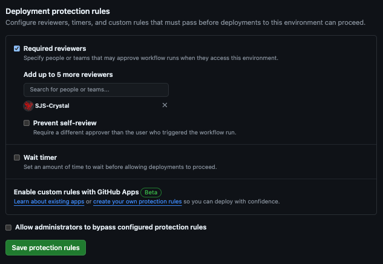
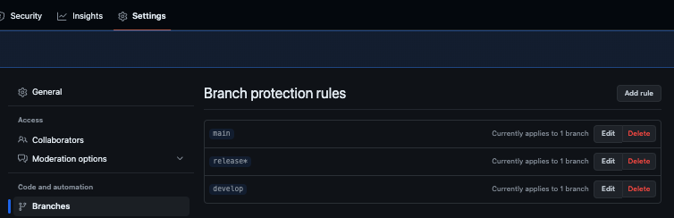
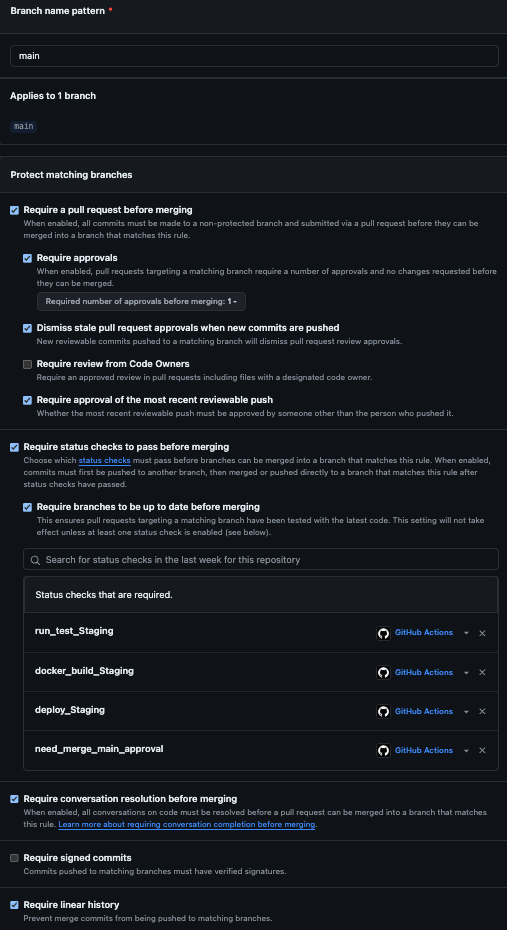
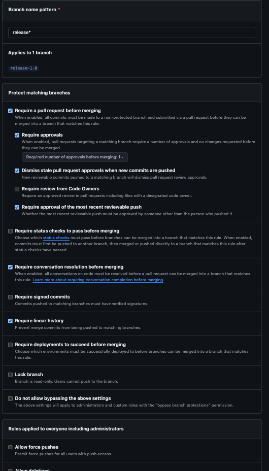
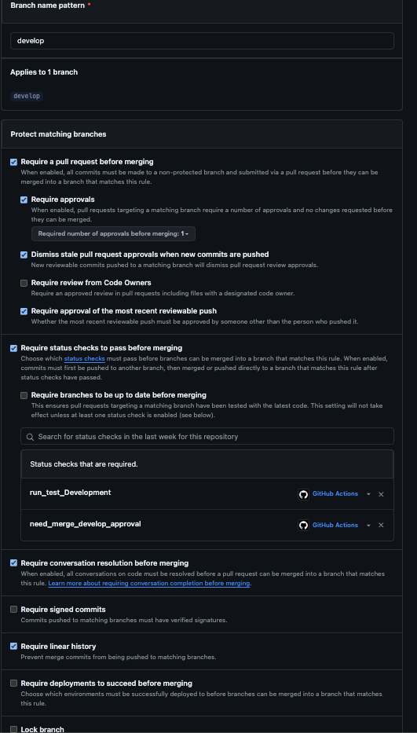
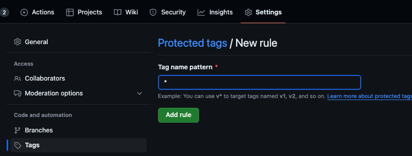
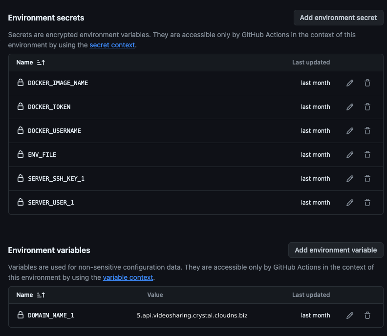
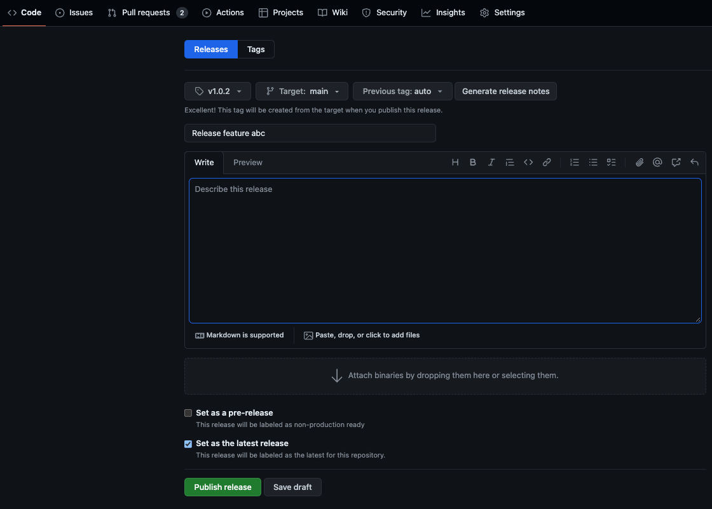
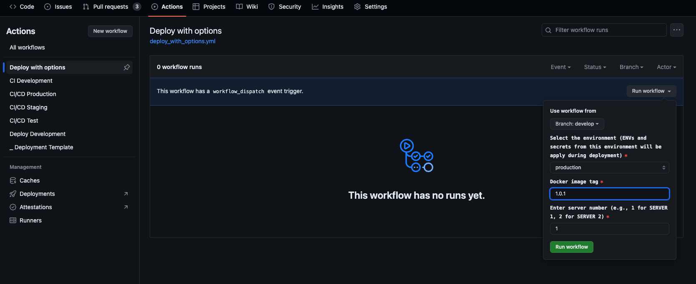

# Introduce
This is project for people can share any youtube videos. And other logged in use can receive notification when someone share new video.

# System Application Overview
 Application base on
  - Ruby 3.3.3
  - Rails 7.1.3
  - Postgresql 16
  - Redis 7.2.4

# How to get the application up and run
- Clone repo git clone https://github.com/SJS-Crystal/youtube_video_sharing_api.git
- Create .env file in root directory from .env.sample
- Run `docker-compose run api rails db:create`
- Run `docker-compose up`

# How to run the test, lint, check security
- Rspec:
  ```sh
  docker-compose run api bundle exec rspec
  ```

- Rubocop:
  ```sh
  docker-compose run api bundle exec rubocop
  ```

- Brakeman:
  ```sh
  docker-compose run api bundle exec brakeman
  ```

- Bundle-audit:
  ```sh
  docker-compose run api bundle exec bundle-audit check --update
  ```


# Deployment

## Prerequirement:
- Make sure you have server with ubuntu 22.04(or later) and domain
- Point your domain to server ip
- In repo, **Settings > Environments**, create 4 environments in repo for contain env variables, secrets: `production`, `development`, `test`, `staging`
- Create 4 environments to restrict deploying: `approval_production_deloyment`, `approval_staging_deloyment`, `approval_test_deloyment`, `approval_development_deloyment`
- Create 2 environments to restrict merging PR into `develop` and `main` branch: `approval_merge_main_branch`, `approval_merge_develop_branch`
- Restrict people can approve deploying and approval merging by config environments: `approval_production_deloyment`, `approval_staging_deloyment`, `approval_test_deloyment`, `approval_development_deloyment`, `approval_merge_main_branch`, `approval_merge_develop_branch`




- In **Settings > Branchs**, create theses 3 rules to make sure github workflow work in correct flow



- `main` rule




- `release*` rule




- `develop` rule




- In repo, **Settings > Tags**, create new rule with pattern `*` to protect all tag, only admin can create new tag for release production




## Preparing
### Config server credentials
1. Create ssh key: run `ssh-keygen` and follow assist prompt, and you have a public key and private key.
2. Copy SSH public key to server: `ssh-copy-id -i <path_to_publib_key> <username>@<host_ip>`.

   Example:
   > `ssh-copy-id -i ~/.ssh/id_rsa.pub root@188.166.236.134`
4. If this is first time you connect to this server, maybe you see a prompt like **Are you sure you want to continue connecting (yes/no)?**, let type `yes` > Enter
5. `cat ~/.ssh/id_rsa` to get ssh private key and copy this and set **SERVER_SSH_KEY_1** secret on github. (*you can adjust ~/.ssh/id_rsa to your file you create above*)
6. Set **SERVER_USER_1** environment secrets on every github environment. **This user must has sudo Privileges**
7. Set **DOMAIN_NAME_1** environment variables on every github environment


### Create Docker hub
- Login https://hub.docker.com/ and create a new repository
- In every github environment, set your **DOCKER_USERNAME** to your docker username
- In every github environment, set your **DOCKER_USERNAME** to your docker repository name
- Access to your docker profile > Security > New Access Token, make sure select `Read & Write` permissions, now you have docker access token
- In every github environment, set your **DOCKER_TOKEN** to your docker access token
- In every github environment, set **ENV_FILE** secret to content in .env file corresponding

    - ENV in every environment: `production`, `development`, `test`, `staging` should look like this

  


    - In `development` environment, can use many servers for deploying many feature branchs. It looks like this:

  


## Deploy
### Development
- Create PR to `develop` branch and comment this command in Conversation tab of PR `/build_and_deploy_s<SERVER NUMBER>`.
    Example:
  > Comment `/build_and_deploy_s1` for to to server 1
  
  > Comment `/build_and_deploy_s2` for deploy to server 2
  
  > ...

### Test
- After PR (merge into develop) is ready for merging, let merge that PR. CD Workflow will be triggered to build and deploy to test environment. 

### Staging
- Create release or hotfix branch
   - Release branch: From `develop` branch, cherry pick commits(that need release) into new release branch starting with `release` like `release-1.0`, `release-1.1` ...
   - Hotfix branch: From `main` branch, check out to new branch starting with `hotfix` like `hotfix-description_xxx`...
- Create PR merge into `main` branch from release or hotfix branch
- CD Workflow will be triggered to build and deploy to staging environment

### Production
- Create PR and Merge code into main from release or hotfix branch
- Create new tag with form `v*.*.*` and target branch(`main`) or commit need release and click `Publish release` button. CD Workflow will be triggered to build and deploy to production 




## Restore
In case need restore to previous version in specify environment, let use `Deploy with options` workflow in `Actions tab > Deploy with options`
- Leave Branch as default
- Select environment need restore
- Select target docker image tag
- Click `Run workflow`

For example, following will restore production environment to image with version 1.0.1

