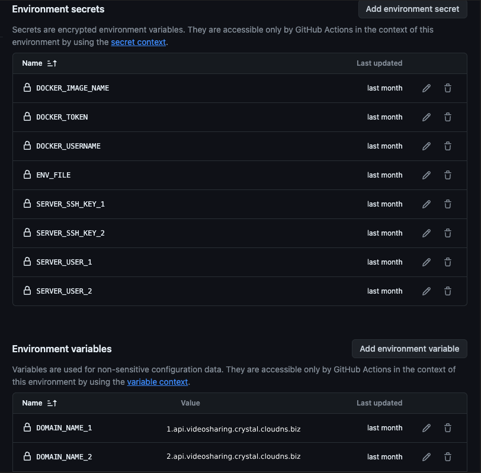

# Introduce
This is application for sharing youtube video

# System Application Overview
 Application base on
  - Ruby 3.3.3
  - Rails 7.0.8
  - Postgresql 16
  - Redis

# How to get the application up and run
- Clone repo git clone https://github.com/SJS-Crystal/youtube_video_sharing_api.git
- Create .env file in root directory from .env.sample
- Run `docker-compose run api rails db:create`
- Run `docker-compose up`

# How to run the test, lint, check security
- Rspec:
  ```sh
  docker-compose run api bundle exec rspec
  ```

- Rubocop:
  ```sh
  docker-compose run api bundle exec rubocop
  ```

- Brakeman:
  ```sh
  docker-compose run api bundle exec brakeman
  ```

- Bundle-audit:
  ```sh
  docker-compose run api bundle exec bundle-audit check --update
  ```

* Services (job queues, cache servers, search engines, etc.)

* Deployment instructions

